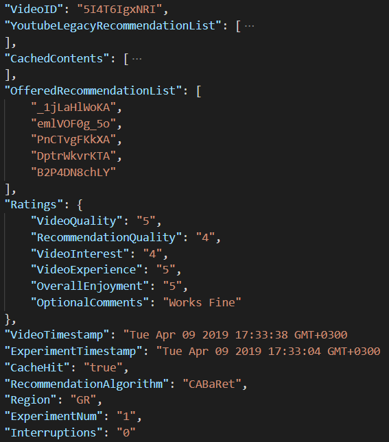

# CABaRet Experimental Testbed

## Motivation
We implemented an experimental platform to collect data from real users. 
Our  goals are:
- monitor real users' behavior in VoD ecosystems
- evaluate the Cache Hit Ratio (CHR) that can be achieved in practice by a cache-aware recommender system
- produce insights regarding Quality of Recommendations (QoR)

## Overview
The platform is built on top of the YouTube video service: it streams videos through the YouTube service, 
and uses the YouTube API to retrieve recommendations and related contents.
This exerimental testbed uses HTML, CSS, JavaScript and PHP on an Apache HTTP Server. It logs every experiment session in a JSON format.
In this repository you can find:
- the code for Front-End
- the code for Back-End
- past experimental logs

## Experiment Session
The UI is designed to accommodate our experiments and a screenshot is shown below.
For the back-end, we assume that a list of cached video IDs is available at the time of the experiment, and we use the YouTube API to embed a YouTube video player in our platform and serve video contents to the participants of the experiment.
Finally, the recommendation module is implemented, using CABaRet as the recommendation algorithm.

  

## How to setup the hosting environment of the application
The application is hosted on an Ubuntu 16.04 server, which runs Apache Web Server with PHP.

To get started with Apache HTTP Server, take a look <a href="https://httpd.apache.org/docs/trunk/en/getting-started.html">here.</a>

Below you can find tutorials on how to setup the prerequisites:

  - <a href="https://www.digitalocean.com/community/tutorials/how-to-install-linux-apache-mysql-php-lamp-stack-on-ubuntu-16-04">Ubuntu 16.04</a>
  
  - <a href="https://www.znetlive.com/blog/how-to-install-apache-php-and-mysql-on-windows-10-machine/">Windows 10</a> 
  
  - <a href="https://jasonmccreary.me/articles/install-apache-php-mysql-mac-os-x/">Mac OS X</a> 

If you want to setup your own domain and make this experiment public (not just localhost), visit <a href="https://www.noip.com/">noip.</a> 

## How to execute queries to the YouTube Data API 
In order to make requests (and receive responses) to the YouTube Data API, you need an API key. You can get yours following this link:

https://developers.google.com/youtube/v3/getting-started .
When you acquire your key, place it in the server scripts that interact with the YouTube API:
  - mostPopularHomepage.php (retrieves most popular videos of the current period and populates homepage)
  - relatedVideos.php (retrieves related videos of a specific video - used in recommendation algorithm)

## Collected data
  - We conducted an experimental campaign recruiting participants through mailing lists and social media, and collected 742 samples from users in regions around the world. 
  - Adding to the platform code, we also publish the dataset with the results of our experiments. 
  - Logfiles are compiled in a JSON format, as shown below:

  

