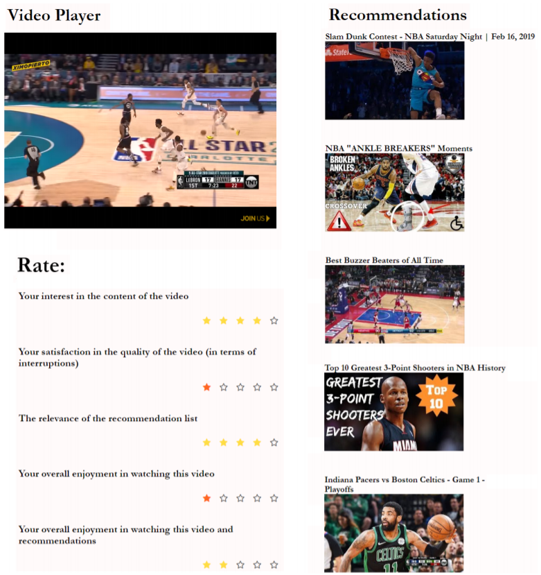

# CABaRet Experimental Testbed

## Motivation
We implemented an experimental platform to collect data from real users. 
Our  goals are:
- monitor real users' behavior in VoD ecosystems
- evaluate the Cache Hit Ratio (CHR) that can be achieved in practice by a cache-aware recommender system
- produce insights regarding Quality of Recommendations (QoR)

## Overview
The platform is built on top of the YouTube video service: it streams videos through the YouTube service, 
and uses the YouTube API to retrieve recommendations and related contents.
This exerimental testbed uses HTML, CSS, JavaScript and PHP in a client-server architecture.
This repository contains the code for the client and server respectively

## Experiment Session
The UI is designed to accommodate our experiments and a screenshot is shown below.
For the back-end, we assume that a list of cached video IDs is available at the time of the experiment, and we use the YouTube API to embed a YouTube video player in our platform and serve video contents to the participants of the experiment.
Finally, the recommendation module is implemented, using CABaRet as the recommendation algorithm.

  

## How to setup the hosting environment of the application
The application is hosted on an Ubuntu 16.04 server, which runs Apache Web Server with PHP. 
It can also be hosted on a Windows or Mac machine. Below you can find tutorials on how to setup the prerequisites:

  - Ubuntu 16.04: 
  
https://www.digitalocean.com/community/tutorials/how-to-install-linux-apache-mysql-php-lamp-stack-on-ubuntu-16-04

  - Windows 10: 
  
https://www.znetlive.com/blog/how-to-install-apache-php-and-mysql-on-windows-10-machine/

  - Mac OS X: 
  
https://jasonmccreary.me/articles/install-apache-php-mysql-mac-os-x/

## Collected data
  - We conducted an experimental campaign recruiting participants through mailing lists and social media, and collected 742 samples from users in regions around the world. 
  - Adding to the platform code, we also publish the dataset with the results of our experiments. 
  - Logfiles are compiled in a JSON format, as shown below:

  

